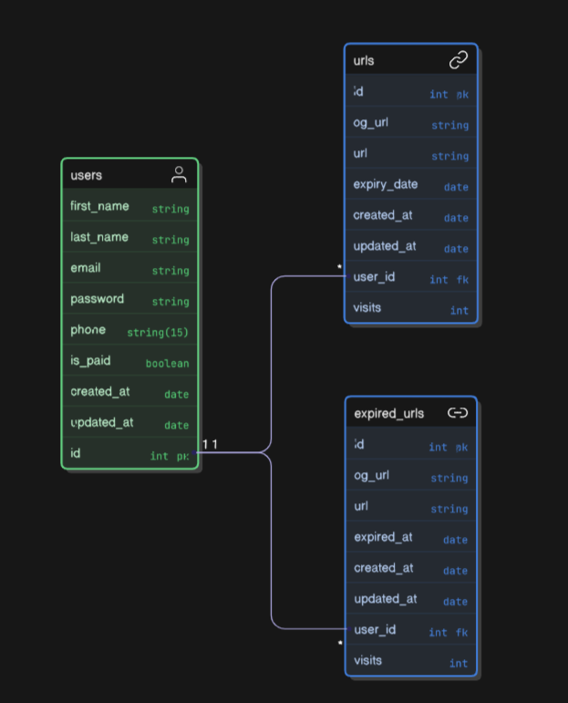

Node Framework     :  Express.js
Database           :  PostgreSQL
ORM                :  Sequelize ORM
Short ID Generator :  custom random string of 6 characters (56,800,235,584)
Short ID Generator :  nanoid (npm package/ v2)

git command

    git checkout -b tikaram

tables: 

## For migrations

    npm install -g sequelize-cli

    npx sequelize-cli migration:generate --name create-urls-table

## For migrate:

    npx sequelize-cli db:migrate

* `npx` runs the `sequelize-cli` without installing it globally.
* `db:migrate` will run all pending migrations from your `migrations/` folder (it keeps track in a special `SequelizeMeta` table in your DB).

| Command | What it does| 
|----------|----------|
| `npx sequelize-cli db:migrate`   | Run pending migrations  |
| `npx sequelize-cli db:migrate:undo`   | Undo the last migration   |
| `npx sequelize-cli db:migrate:undo:all`   | Undo all migrations  |
| `npx sequelize-cli migration:generate --name your-migration-name`   | Create a new migration file   |
| `npx sequelize-cli db:seed:all`   | Run all seeders  |
| `npx sequelize-cli db:seed:undo:all`    | Undo all seeders   |

